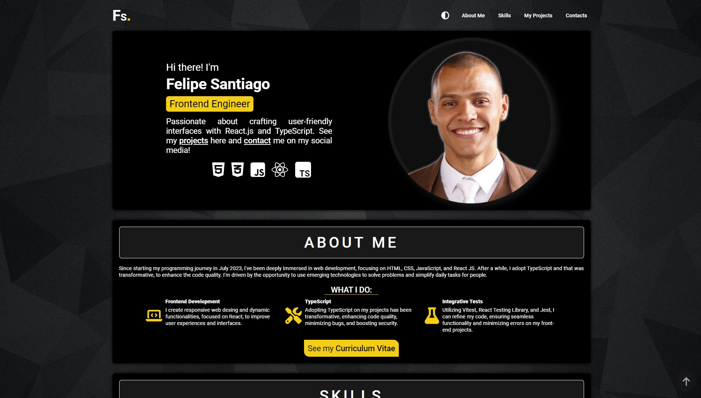
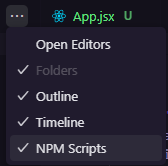
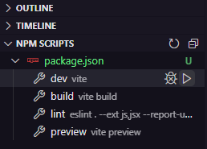
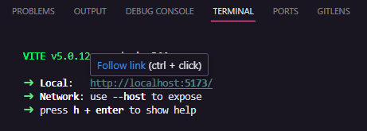

# Personal Project

🧾✍ This is a personal project using React | TypeScript | Vite | Vitest | React Testing Library.

[Click here to view the project in your web browser](https://personal-project-weld.vercel.app).



## Summary

- [General Vision](#general-vision)
  - [Objective](#objective)
  - [Screenshots](#screenshots)
- [My Process](#my-process)
  - [Technologies Used](#technologies-used)
  - [Project Functionality](#project-functionality)
  - [How to Run the Project](#how-to-run-the-project)
  - [Continuous Development](#continuous-development)
  - [Useful Resources](#useful-resources)
- [Author](#author)

## General Vision

### Objective

- Create a personal portfolio project to highlight my skills, knowledge, and objectives.
- To contain a navbar to help the user navigate through the project.
- Sections:
  - About me: Highlight my trajectory, objectives, what I do, and a button to download my curriculum.
  - Skills: Show my soft skills, languages, softwares that I use, libraries, and tools as well.
  - Projects: A filter to filter the category of the projects, list my main works with its GitHub link, the web project, and its banner image.
  - Contact: The links to my social media to receive contact from recruiters and interested people.
- Light design using styled-components.

### Screenshots

#### Functionality


#### Responsivity


## My Process

### Technologies Used

- [React](https://react.dev) - The cornerstone of my development toolkit, empowering me to craft reusable components that form the foundation of robust applications and stunning web interfaces.
- [Styled-Components](https://styled-components.com) - Utilized for styling components, ensuring a cohesive and visually appealing design across the application.
- [Context-API](https://legacy.reactjs.org/docs/context.html) - Employed to implement light and dark theme functionality seamlessly through a theme toggler button, enhancing user experience.
- [LocalStorage](https://developer.mozilla.org/en-US/docs/Web/API/Window/localStorage) - Leveraged to persist the user's preferred page style selection, even after browser sessions are closed.
- [Typescript](https://www.typescriptlang.org) - A JavaScript superset that enhances code quality, minimizes bugs, and boosts security.
- [Font-awesome-icons](https://fontawesome.com) - A straightforward React library for easily integrating a wide range of icons into projects.
- [Vitest](https://vitest.dev) - A test integration software that allows testing Vite projects with the same ease and efficiency as Jest.
- [React-Testing-Library](https://testing-library.com) - An indispensable tool for testing end-user interaction with React web applications, ensuring reliability and functionality.

### Project Functionality

Firstly, I developed the home component, which doesn't contain intricate code. Only styled code was utilized to align and structure the components.
The choice to establish this component is to ensure the App component is evident and straightforward to comprehend.

```tsx
export const Home = () => {
  const { theme } = useContext(ThemeContext);

  return (
    <Container theme={theme}>
      <div className="backgroundImage"></div>
      <Header />
      <Hero />
      <AboutMe />
      <Skills />
      <Projects />
      <Contacts />
      <ScrollButton />
    </Container>
  )
}
```

Let's explain the project passing through each component, starting by the top.

### 1. Header

A simple navbar that will guide the user through the sections of the webpage. Here, each link button has an `<a>` anchor tag that is linked to each component. That way, when it is clicked, the user will be redirected to the specific section. It was used a smooth transition to improve user experience.

```tsx
const links = [
        {text: "About Me", id: "#aboutMe"},
        {text: "Skills", id: "#skills"},
        {text: "My Projects", id: "#myProjects"},
        {text: "Contacts", id: "#contacts"},
    ]

//Rest of the code

  <ul className={`list ${active ? "active" : ""}`}>
      {links && links.map((item, index) =>
          <li className="item" key={index}>
              <a href={item.id}>{item.text}</a>
          </li>
      )}
  </ul>
```
**globalStyle.tsx** - smooth scroll

```tsx
export const GlobalStyle = createGlobalStyle`
// ...
    html {
        scroll-behavior: smooth;
    }
`
```

### 2. Hero

This section is the first impression of the user with the page. It contains the Felipe image, the position that I work on a company, and the technologies that I use.

In this component, into the header one and some others is used a `hover` effect that is repeated constantly. That way, to avoid duplicated codes, it was created a function that contains these style lines to be reused on my components.

```tsx
export const linkHoverEffect = (theme: DefaultTheme, transformOrigin: string, transformDestiny: string,) => `
    transition: .3s;
    position: relative;

    &::after {
        content: '';
        position: absolute;
        bottom: 0;
        left: 0;
        width: 100%;
        height: .2rem;
        background: ${theme.secondaryColor};
        transform: scaleX(0);
        transform-origin: ${transformOrigin};
        transition: transform .5s;
    }

    &:hover::after {
        transform: scaleX(1);
    }

    &:not(:hover)::after {
        transform: scaleX(0);
        transform-origin: ${transformDestiny};
    }
`;
```

### 3. Skills

To highlight my abilities, I put in here the programming languages and software that I work with, my soft skills, and React libraries that I use.

To write everything on a component would create a huge code. That way, to avoid extensive code and to facilitate maintenance, it was created a JSON file to contain this information.

```json
{
    "skills": [
        {
            "category": "Technical Proficiencies",
            "icon": "code",
            "list": [
                "React JS",
                "JavaScript",
                "TypeScript",
                "HTML5",
                "CSS3",
                "Redux",
                "Context API"
            ]
        },
    //...
    ]
}

```
That way, it is possible just to use a `map` method on this file to print this information on the screen.

```tsx  
import skillsData from "@json/index.json";

//...
    <div div div className = "skillLists" >
        { skillsData &&
        skillsData.skills.map((skill, index) => (
            <div className="skill" key={index}>
                <div className="subtitle">
                    <FontAwesomeIcon
                        className="icon"
                        icon={iconMapping[skill.icon] || defaultIcon}
                    />
                    <h3 className="skillTitle">{skill.category}</h3>
                </div>
                <ul className="list">
                    {skill.list.map((item, idx) => (
                        <li className="item" key={idx}>{item}</li>
                    ))}
                </ul>
            </div>
        ))}
    </div >
```

### 4. Projects

The main focus is on here, to show my main GitHub projects, it was used a library that provides a hook called `useGitHubAutomatedRepos` that receives two parameters: the GitHub user nickname and a keyword.

What facilitates the use of this library is that you can change your portfolio just from your GitHub account, then it's not needed to access your repository to change the code directly.

The "about" section of your repository in GitHub, turns possible to add some information:
- The description of your project;
- The website of the project (I use Vercel, that fills this field automatically when the project deploy is made)
- Topics field, that you can add keywords that describe your project.

Through the topics field the `useGitHubAutomatedRepos` hook access all your projects that have a specific keyword and create an array with them.

The syntax is that:
```const data = useGitHubAutomatedRepos("yourNickName", "keyWord")```

Every project that I would like to be published on my portfolio has the "portfolio" keyword. That way, using the "data" variable I can render all information about my projects on the screen, as its name, banner, description, topic, webpage, GitHub repository, and more.

If I want to add a new repository on my portfolio or remove one I just need to change its topics directly from GitHub.

If you are interested on it, access the documentation [Here](https://github.com/DIGOARTHUR/github-automated-repos/).

**Github about repository location**


### 5. Contacts

Using font-awesome icons and an `a` anchor tag, it's possible to visit my social media to contact me.

```tsx
<ul ul className = "social" >
    {
        contacts.map((link, index) =>
            <li className="link" key={index}>
                <a href={link.href} target="_blank">
                    <FontAwesomeIcon icon={link.icon} className="icon" />
                </a>
            </li>
        )
    }
</ul >
```

That way, my projects are detailed, and it is possible to understand my skills, what I'm focusing on, and how to contact me by my social media.

### How to execute the project
- The project was created with [React-Vite](https://vitejs.dev).

- To download the project, open the terminal in the VSCode and write the dependencies code installations: **npm install**

The package.json file already contains the version of the library in its data, so all the libraries used in this project will be installed on your machine in the same way. But if you are interested in how to download, use, or learn more about the libraries that were used in my code, as well as the localStorage, access the links in the [Usefull resources](#usefull-resources).

- To run the project in the browser, it is necessary to activate **NPM Scripts** in the three dots next to the EXPOLORER of VSCode or to write on the terminal `npm run dev`.



- Then, in the bottom-left window of **NPM SCRIPTS**, click on the **run** button next to package.json/dev vite.




- Finally, in the terminal, keep the **localhost** link will appear where the project will be running in your browser. Hover over it and click **Follow link**, or press the ctrl button on your keyboard and click on the **localhost**, and the page will open in your default browser.



There are other ways to open the project, but that form it is the one that I'm used to use.

### Continuous development

After completing the [DevQuest](https://www.linkedin.com/school/devquest-dev-em-dobro/) course, I'm able to work with React, TypeScript, JavaScript, HTML, CSS, and much more around the frontend development world. As a frontend engineer, this project was created to highlight at least a little bit of my abilities and my focus. It was created to keep working through the time, because is my focus to improve the code and the user experience using my website. Thanks to [useGithubAutomatedRepos](https://github.com/DIGOARTHUR/github-automated-repos/) it is possible to maintain and change my main projects through the time just using the GitHub and remotely, because I know that this is just the beginning of my career. I have much more to learn and to show.

### Useful Resources

- [Styled-Components](https://styled-components.com): Utilizing tagged template literals (a recent addition to JavaScript) and the power of CSS, styled-components allows you to write actual CSS code to style your components. It also removes the mapping between components and styles – using components as a low-level styling construct could not be easier!

- [Context-API](https://legacy.reactjs.org/docs/context.html): Context provides a way to pass data through the component tree without having to pass props down manually at every level.

- [LocalStorage](https://developer.mozilla.org/en-US/docs/Web/API/Window/localStorage): The localStorage read-only property of the window interface allows you to access a Storage object for the Document's origin; the stored data is saved across browser sessions.

- [TypeScript](https://www.typescriptlang.org): TypeScript enhances JavaScript development with static typing, improved tooling, and better code readability, leading to more robust and maintainable applications.

- [useGithubAutomatedRepos](https://github.com/DIGOARTHUR/github-automated-repos/): A hook used in a library focused to administrate your repositories remotely from your github, beeing not necessary change your repository directly do add or remove new informations or repositories.

## Author

- GitHub - [Felipe Santiago Morais](https://github.com/SantiagoMorais)
- Linkedin - [Felipe Santiago](https://www.linkedin.com/in/felipe-santiago-873025288/)
- Instagram - [@felipe.santiago.morais](https://www.instagram.com/felipe.santiago.morais)
- Email - <a href="mailto:contatofelipesantiago@gmail.com" target="blank">contatofelipesantiago@gmail.com</a>
- <a href="https://api.whatsapp.com/send?phone=5531996951033&text=Hi%2C%20Felipe%21%20I%20got%20your%20contact%20from%20your%20portfolio.">Whatsapp</a>


